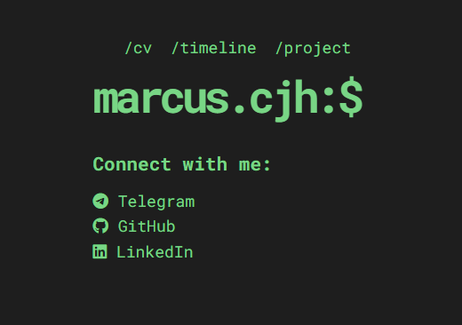

# Marcus Chan - Portfolio

A modern, responsive portfolio website built with TypeScript, Vite, and modern web technologies. Features interactive animations, responsive design, and automated CI/CD deployment.



## 🚀 Quick Start

```bash
# Install dependencies
npm install

# Start development server
npm run dev

# Run tests
npm run test

# Build for production
npm run build

# Deploy to GitHub Pages
npm run deploy
```

## 📁 Project Structure

```
├── src/
│   ├── main.ts               # Main application entry
│   ├── services/             # Data & loading services
│   ├── components/           # UI components (Matrix, Particles, TypedText)
│   ├── lib/                  # Utilities & constants
│   ├── styles/               # CSS with modern features
│   └── test/                 # Unit tests (76% coverage)
├── public/data.json          # Site content & configuration
└── .github/workflows/        # CI/CD automation
```

## 🎨 Customization

Edit `public/data.json` to update:
- Personal information
- Project showcase
- Timeline entries
- Social media links

## 🛠️ Tech Stack

- **TypeScript** - Type-safe development
- **Vite** - Fast build tool & dev server
- **Vitest** - Modern testing framework
- **ESLint + Prettier** - Code quality & formatting
- **CSS3** - Modern styling with custom properties
- **GitHub Actions** - Automated CI/CD


---

**Marcus Chan** - [GitHub](https://github.com/MarcusCJH) | [LinkedIn](https://www.linkedin.com/in/marcuschanjh) | [Portfolio](https://marcuscjh.github.io)